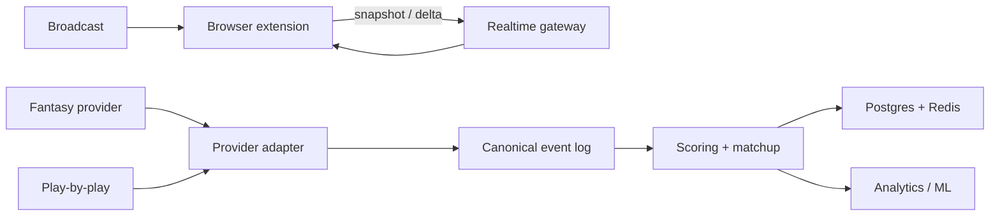

# Fantasy Football HUD

A project-based engineering capstone that grows a fake-data Chrome HUD into a real-time, explainable fantasy-football system. Early versions are runnable and intentionally small; later versions are design-and-lab targets, not claims of production completeness.

## Vision

While watching a supported football broadcast, see the players that matter to your matchup, the play that changed their score, and what the result means. The end state combines a browser overlay, provider adapters, canonical events, matchup state, probability, and optional computer-vision experiments.

## Architecture



## Monorepo

apps/ user-facing surfaces; services/ backend boundaries; packages/ contracts and domain logic; simulation/ replay and fault injection; infra/ local delivery and deployment notes; ml/ probability, calibration, vision, tracking, OCR, identity; docs/ architecture and ADRs; learning/ concept modules; curriculum/ V0–V12 guides.

## Setup

Node.js 20+ and npm 10+:

```bash
npm install
npm run typecheck
npm run build
```

Load apps/extension/dist as an unpacked Chrome extension. The current simulator needs no credentials.

## Roadmap

| Version | Outcome | Focus |
|---|---|---|
| V0 | Fake events update HUD | Extension, React, TypeScript |
| V1 | Configurable accurate scoring | Domain modeling and tests |
| V2 | Persistent league state | Schemas and migrations |
| V3 | Fantasy provider adapter | HTTP, DTOs, rate limits |
| V4 | Live play ingestion | Normalization, cursors, replay |
| V5 | Reliable processing | Idempotency, ordering, retries |
| V6 | Backend read model | Async Python, REST, Postgres, Redis |
| V7 | Push updates | WebSockets, snapshots, reconnect |
| V8 | Matchups and identity | Tenancy and authorization |
| V9 | Operable delivery | Logs, metrics, traces, CI/CD |
| V10 | Win probability | Monte Carlo and calibration |
| V11 | Resilience and scale | Brokers, backpressure, load tests |
| V12 | Broadcast-ready experiments | Vision, tracking, OCR, identity |

Suggested pacing is 4–6 months at 5–7 hr/week, but milestone evidence matters more than dates. For every version: read prerequisites, predict, implement, inject failure, answer checkpoints, and document deferrals.

See curriculum/PROGRESS.md, docs/architecture, docs/adrs, and learning/REFERENCES.md. ADR-001 in docs/adr is preserved Sprint 0 work.
