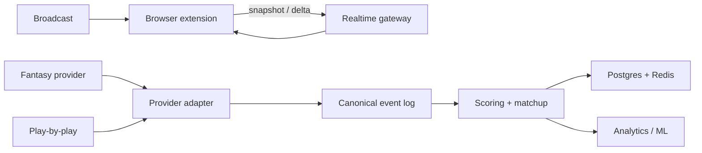

# Fantasy Football HUD

A project-based engineering capstone that grows a fake-data Chrome HUD into a real-time, explainable fantasy-football system. Early versions are runnable and intentionally small; later versions are design-and-lab targets, not claims of production completeness.

## Vision

While watching a supported football broadcast, see the players that matter to your matchup, the play that changed their score, and what the result means. The end state combines a browser overlay, provider adapters, canonical events, matchup state, probability, and a measurable real-time vision pipeline with calibrated abstention.

## Architecture


```mermaid
flowchart LR
  B["Broadcast"] --> E["Browser extension"]
  E -->|snapshot / delta| G["Realtime gateway"]
  F["Fantasy provider"] --> A["Provider adapter"]
  P["Play-by-play"] --> A
  A --> Q["Canonical event log"]
  Q --> S["Scoring + matchup"]
  S --> D["Postgres + Redis"]
  S --> M["Analytics / ML"]
  G --> E
```

## Monorepo

apps/ user-facing surfaces; services/ backend boundaries; packages/ contracts and domain logic; simulation/ replay and fault injection; infra/ local delivery and deployment notes; ml/ probability, calibration, vision, tracking, OCR, identity; docs/ architecture and ADRs; learning/ concept modules; curriculum/ V0–V25 guides.

## Setup

Node.js 20+ and npm 10+:

```bash
npm install
npm run typecheck
npm run build
```

Load apps/extension/dist as an unpacked Chrome extension. The current simulator needs no credentials.

## Roadmap

| Version | Outcome | Focus |
|---|---|---|
| V0 | Fake events update HUD | Extension, React, TypeScript |
| V1 | Configurable accurate scoring | Domain modeling and tests |
| V2 | Persistent league state | Schemas and migrations |
| V3 | Fantasy provider adapter | HTTP, DTOs, rate limits |
| V4 | Live play ingestion | Normalization, cursors, replay |
| V5 | Reliable processing | Idempotency, ordering, retries |
| V6 | Backend read model | Async Python, REST, Postgres, Redis |
| V7 | Push updates | WebSockets, snapshots, reconnect |
| V8 | Accounts and tenancy | Per-user authorization and provider connections |
| V9 | Operable delivery | Logs, metrics, traces, CI/CD |
| V10 | Win probability | Monte Carlo and calibration |
| V11 | Resilience and scale | Brokers, backpressure, load tests |
| V12 | Vision contract | Safety gates, metrics, schemas, authorized inputs |
| V13 | Evaluation corpus | Dataset versioning, annotation, game-level splits |
| V14 | Broadcast scene gate | Shot types, camera cuts, field-of-play detection |
| V15 | Player detector | Player/official detection and sliced evaluation |
| V16 | Multi-object tracking | Stable track IDs, occlusion, association metrics |
| V17 | Field geometry | Camera motion, homography, overlay coordinates |
| V18 | Team and role evidence | Home/away/official/unknown classification |
| V19 | Jersey evidence extraction | Visibility, body regions, crop quality |
| V20 | Temporal jersey recognition | Tracklet-level number distributions and abstention |
| V21 | Player identity fusion | Roster resolution, calibration, precision–coverage |
| V22 | Real-time vision runtime | Bounded queues, ONNX/TensorRT, latency budgets |
| V23 | HUD vision integration | Replay events, broker delivery, synchronized markers |
| V24 | Permitted live shadow mode | Live validation without user-visible identity claims |
| V25 | Vision operations and release | Drift, model registry, canaries, rollback, release gates |

The backend learning arc is V0–V11. V12–V25 form a second, deliberately
granular vision-systems arc. Pacing is milestone-based: every version requires a
reproducible artifact, measured evidence, an injected failure, and a written
decision before advancing.

See `curriculum/PROGRESS.md`, the [vision roadmap](docs/vision-roadmap.md),
`docs/architecture`, `docs/adrs`, and `learning/REFERENCES.md`. ADR-001 in
`docs/adr` is preserved Sprint 0 work.

## Integrated local application

Start the durable API and command center:

```bash
docker compose -f infra/dev/docker-compose.yml up --build -d
npm run build
```

Open `http://127.0.0.1:5174` and load `apps/extension/dist` as an unpacked
Chrome extension. Create the same account in the command center and extension.
In the popup, enter the ESPN league ID and team ID, then
select **Load ESPN roster**. Refresh an open YouTube tab after reloading the
extension so its content script can render the overlay.

The API now includes per-user authorization, encrypted provider-connection
storage, a deduplicated canonical event inbox, transactional score projections,
an outbox-to-Redis delivery path, Prometheus metrics, JSON logs, optional OTLP
traces, checksummed migrations, CI, and backup/restore drills. See
`docs/operations.md` and `docs/vision-system-design.md`.

Grafana is available at `http://127.0.0.1:3000` with local-only credentials
`admin` / `fantasy_hud_dev`. Its provisioned dashboard combines Prometheus API
telemetry with PostgreSQL league and scoring statistics. Prometheus is at
`http://127.0.0.1:9090`. Change credentials and use a read-only database role
outside local development.

See `docs/product-architecture.md` for implemented boundaries, deliberate
deferrals, cloud direction, and the vision-system learning path.
