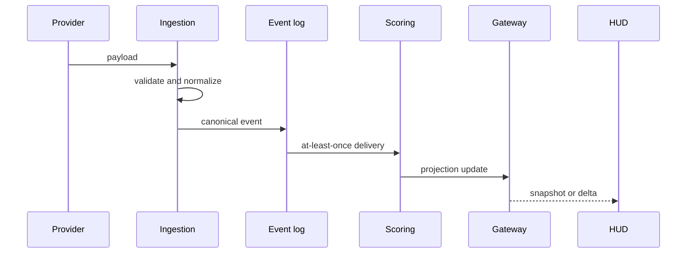

# Event flow

```mermaid
sequenceDiagram
  participant P as Provider
  participant I as Ingestion
  participant B as Event log
  participant S as Scoring
  participant G as Gateway
  participant H as HUD
  P->>I: payload
  I->>I: validate and normalize
  I->>B: canonical event
  B->>S: at-least-once delivery
  S->>G: projection update
  G-->>H: snapshot or delta
```

Before V6, several participants are simulated or in-process.
