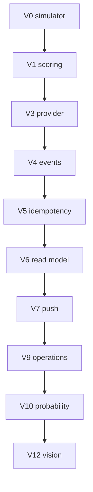
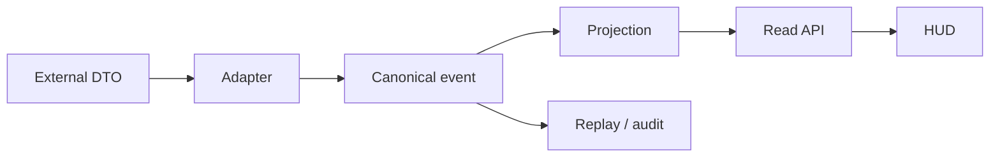

# System overview

```mermaid
flowchart TB
  V0["V0 simulator"] --> V1["V1 scoring"] --> V3["V3 provider"] --> V4["V4 events"] --> V5["V5 idempotency"]
  V5 --> V6["V6 read model"] --> V7["V7 push"] --> V9["V9 operations"] --> V10["V10 probability"] --> V12["V12 vision"]
```

```mermaid
flowchart LR
  RAW["External DTO"] --> ADAPTER["Adapter"] --> EVENT["Canonical event"] --> PROJECTION["Projection"] --> API["Read API"] --> HUD["HUD"]
  EVENT --> AUDIT["Replay / audit"]
```

These are teaching boundaries, not claims that every box exists today.
