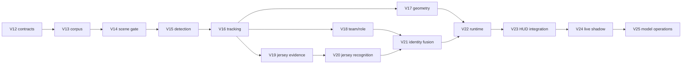

# Granular real-time vision roadmap

The vision system is a second engineering program built on top of the fantasy
platform. It is intentionally divided into small versions so model accuracy,
temporal behavior, latency, and product safety can be diagnosed independently.

## Dependency map

## Phases

| Phase | Versions | Question answered | Exit evidence |
|---|---|---|---|
| Foundations | V12–V13 | Can experiments be trusted and reproduced? | Contracts, manifests, permitted data, validated splits |
| Perception | V14–V17 | Can players be found, followed, and located stably? | Scene, detection, tracking, and geometry reports |
| Identity evidence | V18–V21 | Can a track be mapped safely to a player? | Calibrated team/jersey evidence and precision–coverage gate |
| Real-time product | V22–V23 | Can the pipeline remain current and render correctly? | Full-game soak, broker replay, synchronized authenticated HUD |
| Live operations | V24–V25 | Can it be validated and operated without unsafe releases? | Shadow reviews, drift monitors, canary and rollback drills |

## Version index

| Version | Primary deliverable | Decision unlocked |
|---|---|---|
| [V12](../curriculum/versions/V12.md) | Vision contracts and safety gates | What every stage must prove |
| [V13](../curriculum/versions/V13.md) | Authorized evaluation corpus | Whether comparisons are valid |
| [V14](../curriculum/versions/V14.md) | Shot and camera-cut gate | When temporal state may continue |
| [V15](../curriculum/versions/V15.md) | Player/official detector | Which detector meets application needs |
| [V16](../curriculum/versions/V16.md) | Online tracker | Which association strategy is trustworthy |
| [V17](../curriculum/versions/V17.md) | Geometry and coordinates | Where a marker belongs on screen |
| [V18](../curriculum/versions/V18.md) | Team and role evidence | Which candidate identities remain plausible |
| [V19](../curriculum/versions/V19.md) | Jersey visibility and crops | Whether number evidence should be attempted |
| [V20](../curriculum/versions/V20.md) | Temporal number distribution | What jersey numbers the track supports |
| [V21](../curriculum/versions/V21.md) | Calibrated identity resolver | Whether an identity is safe to display |
| [V22](../curriculum/versions/V22.md) | Bounded real-time graph | Whether the system stays current for a game |
| [V23](../curriculum/versions/V23.md) | Replay-to-HUD integration | Whether production transport/rendering is correct |
| [V24](../curriculum/versions/V24.md) | Permitted live shadow evidence | Whether offline results survive live conditions |
| [V25](../curriculum/versions/V25.md) | Model operations and release controls | Whether vision can be promoted and rolled back safely |

## Rules for advancing

1. Pass the current version's hard gates before starting its successor.
2. Keep an unchanged baseline; change one major component per comparison.
3. Tune on validation data and open the test set only for a frozen decision.
4. Report overall metrics and difficult scenario slices.
5. Preserve timestamps and intermediate records for deterministic replay.
6. Treat `unknown` and text-only fallback as valid safe outputs.
7. Do not let play-by-play or roster membership become false visual proof.
8. Do not connect an unvalidated identity model to user-visible live markers.

## Current next action

Begin with V12. Implement contracts and an experiment manifest before acquiring
models or building an annotation workflow. That prevents model-specific output
formats from becoming accidental architecture and makes all later experiments
comparable.
