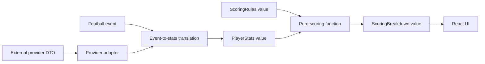

# Domain modeling deep dive — V1

## Concept: value objects

A value object is a group of values whose meaning comes from its contents rather than from a unique identity. In the fantasy-football domain, `PlayerStats`, `ScoringRules`, and `ScoringBreakdown` are value objects. A scoring breakdown with the same category values represents the same calculation, regardless of which JavaScript object holds it.

This differs from an entity such as `Player`. A player has an identity, such as `kittle`, that remains meaningful while the player's statistics and fantasy points change.

Value objects help make domain rules explicit. Instead of passing unrelated numbers into a function, the scoring engine receives a `PlayerStats` value and a `ScoringRules` value:

```text
PlayerStats + ScoringRules → ScoringBreakdown
```

The result can be returned without changing either input. That makes the calculation easier to test and explain.

## Boundary diagram



The provider adapter protects the internal model from external field names and formats. The scoring function belongs to the domain boundary and should not know about React, browser storage, or provider APIs.

## Connection to V1

V1 moves scoring out of the UI and makes the scoring rules configurable. The `PlayerStats` and `ScoringRules` types are internal contracts. `scorePlayer` applies the domain rules and returns an explainable breakdown. The invariant is that the breakdown total equals the sum of its categories.

## Experiment

Run the same stat line through standard scoring and PPR scoring. Change only `receptionPoints` from `0` to `1`. The total should increase by exactly the number of receptions. This demonstrates that the scoring function is stable while league policy is represented as configuration.

## Takeaway

Domain modeling is deciding which concepts, rules, and boundaries deserve names in the code. In V1, the important boundary is between football facts, league policy, calculated fantasy points, and presentation.
